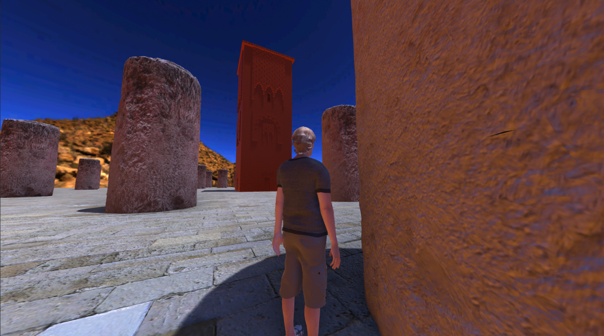

# 🕌 3D Simulation: Hassan Tower - Unity Project

An interactive simulation of the Hassan Tower in Rabat, developed as part of the **Introduction to Visual Computing** course at INPT.

---

## 🎯 Project Objective

To apply the fundamentals of visual computing through an immersive project built in Unity 3D using C#, while highlighting **Morocco’s cultural heritage**.

This prototype could serve as a foundation for a larger platform aimed at **exploring Moroccan monuments in virtual reality** — for **tourism, education, and cultural awareness**.

---

## 🌄 Preview

  

  

---

## 🧩 Key Features

- **Third-person camera view** with smooth mouse-controlled rotation  
- **Player controls**: ZQSD/WASD movement, jump, sprint  
- **Animations**: idle, walk, and jump  
- Visually immersive environment:  
  - Cobblestone ground texture  
  - Panoramic desert-style skybox  
  - Dynamic lighting and shadows  
- **Unity EventSystem** included for future UI compatibility

---

## 📂 Useful Links

- 🎥 [Presentation Video (Drive)](https://drive.google.com/file/d/1Sls_-BBmr0wCPffzsA-JvIAO9SUi3TDP/view?usp=sharing)  
- 📝 [Project Report (Drive)](https://drive.google.com/file/d/1nwRbEnpvmzppEFgmnGj7FviG2imwkqID/view?usp=sharing)

---

## 👥 Developed By

- Alae Eddine JAHID  
- Mohamed Khalil ASSADDIKI  
Supervised by **Prof. Amina RADGUI**  
INPT — 1st Year, Engineering Cycle

---

## 🇲🇦 About the Project

This project reflects our commitment to integrating **Tamghrabit**, our Moroccan identity, into our technical initiatives.  
It demonstrates how modern tools like Unity can be used to **preserve, simulate, and celebrate cultural heritage** in the digital era.

---

